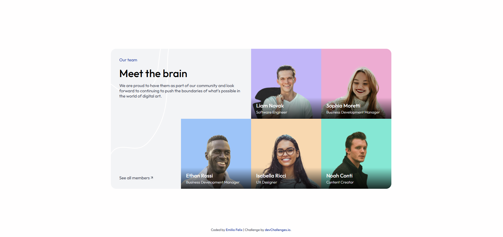

<!-- Please update value in the {}  -->

<h1 align="center">Meet the Team Section | devChallenges</h1>

   Solution for a challenge <a href="https://devchallenges.io/challenge/meet-the-team-section-challenge" target="_blank">Meet the Team Section</a> from <a href="http://devchallenges.io" target="_blank">devChallenges.io</a>.

  <h3>
    <a href="{https://your-demo-link.your-domain}">
      Demo
    </a>
     | 
    <a href="{https://your-url-to-the-solution}">
      Solution
    </a>
     | 
    <a href="https://devchallenges.io/challenge/meet-the-team-section-challenge">
      Challenge
    </a>
  </h3>

<!-- TABLE OF CONTENTS -->

## Table of Contents

- [Overview](#overview)
  - [What I learned](#what-i-learned)
  - [Useful resources](#useful-resources)
- [Built with](#built-with)
- [Features](#features)
- [Contact](#contact)
- [Acknowledgements](#acknowledgements)

<!-- OVERVIEW -->

## Overview

This project is a fully responsive "Meet the Team" grid layout. The goal was to build a clean, premium UI that scales flawlessly from a 4-column enterprise desktop view down to a single-column mobile feed without losing structural integrity.

### What I learned

Layering & Z-Index: Learned how to stack text and gradients over images using absolute positioning.

Responsive Grid: Mastered grid-template-areas to snap the layout between 4, 3, and 1 columns depending on the device.

Centering & Viewports: Used Flexbox and 100vh to lock the content perfectly in the center of the screen.

Hover Effects: Implemented smooth image scaling to make the UI feel interactive and premium.

### Built with

- Semantic HTML5 markup
- CSS custom properties
- Flexbox
- CSS Grid

## Features

This application/site was created as a submission to a [DevChallenges](https://devchallenges.io/challenges-dashboard) challenge.

## Author

- GitHub [@emiliofelixdev](https://{github.com/emiliofelixdev)
